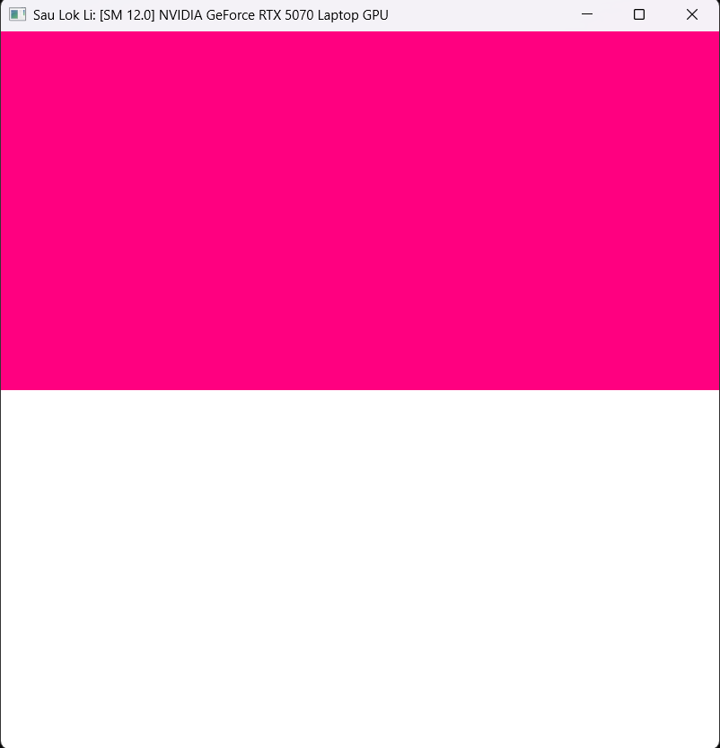
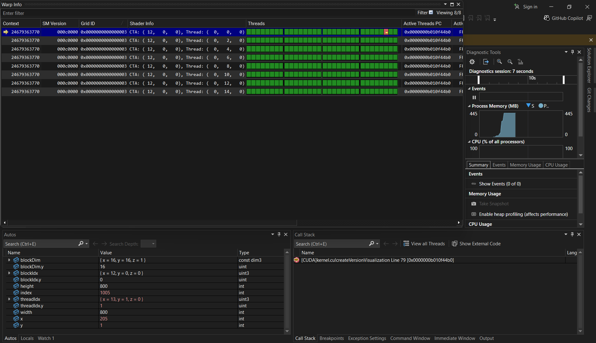
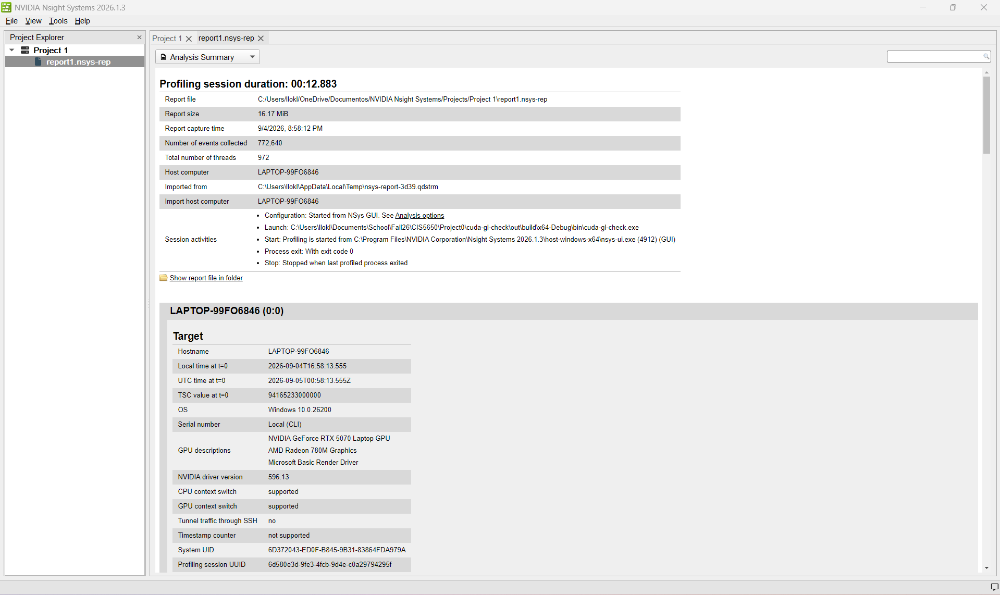
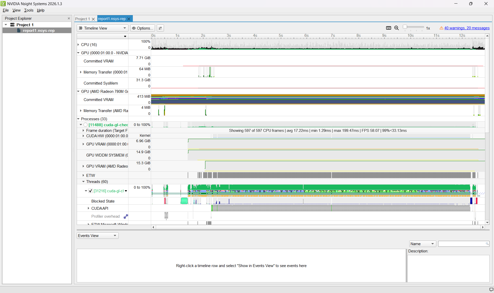
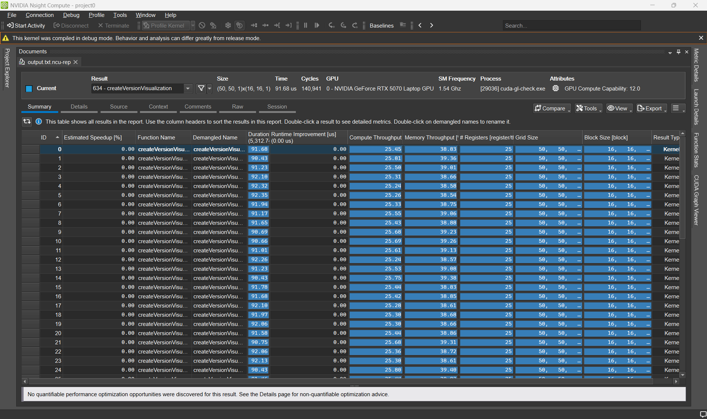
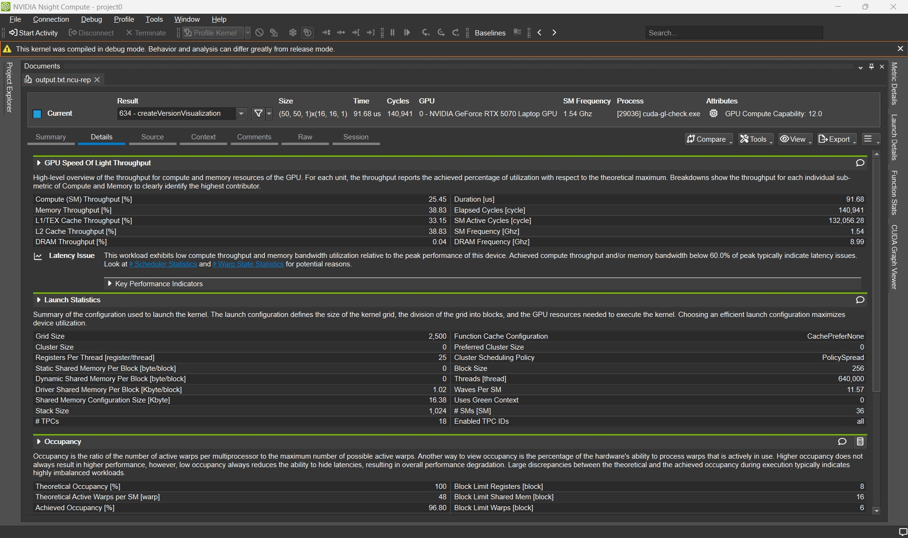
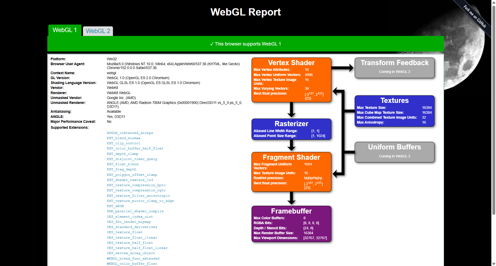
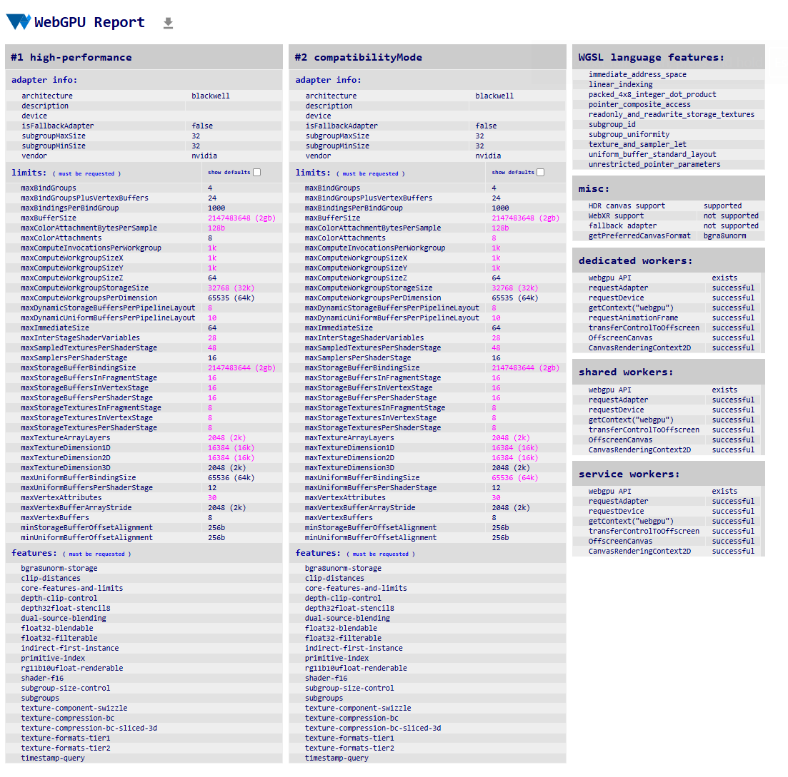

Project 0 Getting Started
====================

**University of Pennsylvania, CIS 5650: GPU Programming and Architecture, Project 0**

* Sau Lok Li
* Tested on: Windows 11, AMD Ryzen 9 270 32GB, NVIDIA GeForce RTX 5070 Laptop 8GB (Personal Laptop)

## CUDA GL Check

## Nsight Debugger

## Nsight Systems

## Nsight Compute

## WebGL

## WebGPU

